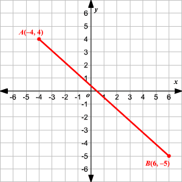
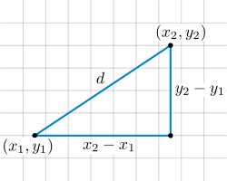

<p align="center"></p>
<h1 align="center">2D Raycasting</h1>
<h3 align="center"> Implementation of a 2D raycasting algorithm using Pygame</h3>
<p align="center"></p>

---

### Using the app
If you want to use the web in your computer, you should follow this steps.
##### Prequisites
* Python (v3.7+) installed.
* Git installed and configured
* pip (v3) instaled
##### Steps
###### Clone the repository in your local machine
```shell
git clone https://github.com/PabloCorbCon/2d-raycast.git
```
###### Move inside the repository
```shell
cd 2d-raycast
```
###### Install all the packages needed
```shell
pip install -r requirements.txt
```
###### Start the Pygame app
```
python app.py
```
###### If you have multiple Python instalations use Python 3(+7)
```
python3 app.py
```

#### For contributing to the project read the [CONTRIBUTING.md](https://github.com/PabloCorbCon/2d-raycast/blob/main/CONTRIBUTING.md) file
---

### Configuration
All the **configuration** of the application has been **externalized** to the code itself so that you can modify it to your liking in the simplest way possible.

You can see the default configuration in the `CONFIG.json` file.

You can modify this configuration to your liking, for example to change the width of the tiles or the color of the walls.

#### Adding walls
You can also add walls to the game. Just go to the `/walls/walls` configuration file section and you will see a list of values with this syntax.
```
[
  [[a1, b1], [c1, d1]],
  [[a2, b2], [c2, d2]],
  ...
  [[aN, bN], [cN, dN]]
]
```
These lists represent Cartesian coordinates, in a plane a segment has a start point and an end point. **This two points can be seen as** `a & b`where `a = {x1, y1}` and `b = {x2, y2}`. **So the wall segments are determined in the form of**:
```
[
  [[x1, y1], [x2, y2]]
]
```
<p align="center"></p>

###### Segment in a full cartesian plane

In our game we **consider that** `{a, b} ∈ N`.

---

### About RayCasting

The so-called RayCasting is a technique designed to **solve multiple problems in ray tracing to an object by simulating natural light rays**. In RayCasting a ray is traced from a point `a` to a point `a + 1` as long as this ray does not collide with any obstacle.

Taking this into account, we can launch rays that advance in a certain direction. These rays will never stop moving unless they hit an obstacle.

Techniques as complex as Envidia RTX can be simplified to the maximum with a two-dimensional demonstration like the one in this repository. After all, Ray tracing is based on bouncing light rays with the most light-like properties possible against solid objects.

<p align="center"></p>

When a casting beam detects an obstacle, it can **produce a signal**, this could be used for countless purposes such as improving the physics of a simulator or even improving the layout of lasers in a game. The possibilities are endless. To check the distance of the ray to an object, you can use **any mathematical equation**. In this project we use the **Euclidean distance** formula to calculate the distance.


<p align="center"></p>

---

#### This project is under the Apache 2.0 [License](https://github.com/PabloCorbCon/2d-raycast/blob/main/LICENSE)
```
Copyright 2020 - @pablocorbcon

Licensed under the Apache License, Version 2.0 (the "License");
you may not use this file except in compliance with the License.
You may obtain a copy of the License at

    http://www.apache.org/licenses/LICENSE-2.0

Unless required by applicable law or agreed to in writing, software
distributed under the License is distributed on an "AS IS" BASIS,
WITHOUT WARRANTIES OR CONDITIONS OF ANY KIND, either express or implied.
See the License for the specific language governing permissions and
limitations under the License.
```
##### Read more [here](https://www.apache.org/licenses/LICENSE-2.0)
